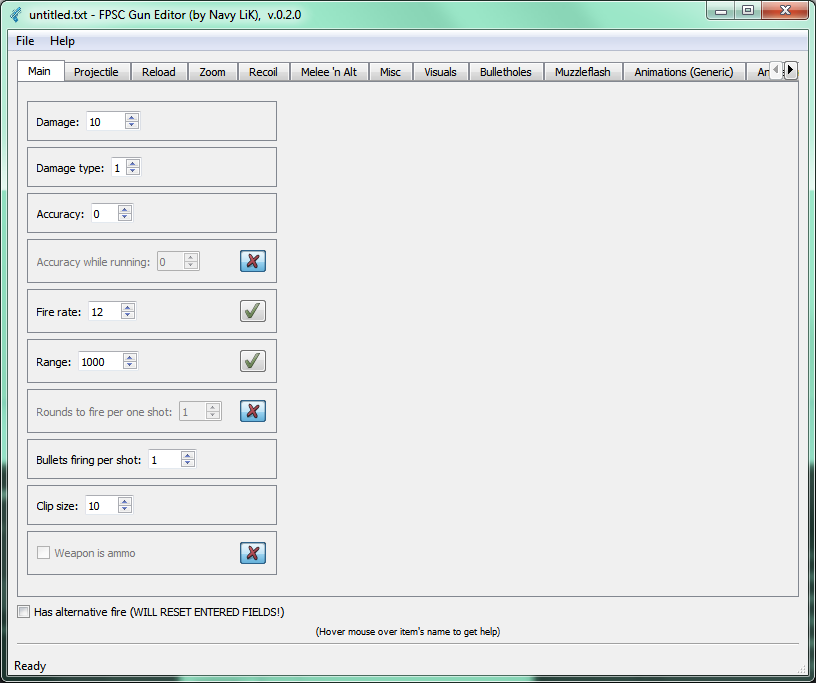

### GunED: Gunspec Editor Tool for FPS Creator

This is a small tool for FPS Creator (by TheGameCreators) users which allows them to **edit gunspec.txt** files in visual mode.

## Why?

FPSC is a great engine, but it lacks lots of simple instruments. After fiddling with gunspec files for a couple of days, I realized that manually editing it is a vicked task. There are a bunch of commands with ill-remembered names, and for any refinement you need to flip through a thick reference book. So I made my own tool.

## How to use it?
There is an editor that allows you to **load existing** or **create new** gunspec files. 

- Interface provides you a set of **tabs**, each contains **parameters** of the weapon. 
- Also, you may see **description** of each parameter (and its gunspec name) simply by hovering mouse over it.
- You may use **a button** next to the parameter's value to add / remove it. 
- Removed parameter becomes gray, and is marked with ***cross symbol*** instead of ***check***.
- You may add alt-fire mode to your weapon by selecting "Has alternate fire". This will add a second column to parameters list.
- The **last tab** is a tab for manual entering any commands you like. When you open a file with some broken or unknown lines, all of them would be listed on that tab.
- You may **add any new command** by changing gunspec.xml file without recompiling the app.

## TODO list:
- Make app to find and remember current FPSC installation folder.
- "Last opened" list.
- Add drag & drop.
- Make alt-mode switching less painful.
- Make simple help system.
- Clean the code.
- Make an installer.
- Make some localizations.

## Changelog
###### v.0.2.5. Bugfixes and small features
- Fixed small bugs in programm interface after saving and loading files.
- Added beautiful progress indicators.
- Added command line arguments parser. Now you may open file with GunED from CMD or any app, or by just dropping gunspec.txt to GunED's link (drag and drop inside the windows is still not done).
- Made some improvements of the source code.

###### v.0.2.0. More stable release
- Fixed "Save" menu option.
- Fixed some of save file / new file problems.
- Added notifications when your file is not saved and you want to drop it *(mostly)*.
- Added new fancy icons for add/remove buttons.
- Added this readme.

###### v.0.1.0. Initial release
- App is mostly working. 
- There are tons of bugs, so backup your gunspec files before overwriting *(therefore, nothing should be damaged when reading)*. 
- Yes, and the "Save" button does not work yet, just use "Save as".

**Good luck, have fun!**
